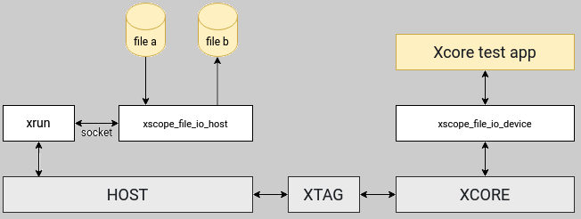

# Xscope FileIO

This library allows a program on the xCore to access binary files on the host machine
via xscope.

Currently it supports:

  * Arbitrary number (32 currently) of **read or write** files (not read/write)

  * **Sequential** (not random) access only

  * “wb” and “rb” file access mode only

  * 6-8MBytes/s Device to Host speed

  * 150-850kBytes/s Host to Device speed (Linux < 200kB, Mac > 800kB)

This compares to around 2kBytes/s for fileio over JTAG supported using `xrun --io`.

## Installation

`pip install -e .` or `pip install .`

To compile firmware code, add `src_xcore` to your source dirs and include dirs.

**Ensure you use the `config.xscope` included in `src_xcore`.**


## Host side API

The host-side interface is written in Python. To run an xcore binary with access to
xscope fileIO,
use:
```python
xscope_fileio.run_on_target(adapter_id, firmware_xe, use_xsim=False)
```
This can be combined with xtagctl e.g.:

```python
with xtagctl.acquire("XCORE-AI-EXPLORER") as adapter_id:
    xscope_fileio.run_on_target(adapter_id, device_xe)
```


## Device side API

Source and header files for device code are found in `src_xcore`

```c
void xscope_io_init(chanend_t xscope_end);

xscope_file_t xscope_open_file(char* filename, char* attributes);

size_t xscope_fread(uint8_t *buffer, size_t n_bytes_to_read, xscope_file_t *xscope_io_handle);

void xscope_fwrite(uint8_t *buffer, size_t n_bytes_to_write, xscope_file_t *xscope_io_handle);

void xscope_close_files(void);
```

Note currently missing from fileio api:

```
fseek, ftell, fprintf,  fscanf
```

## System Architecture

The `run_on_target` function calls `xrun --xscope-port` with the binary and specified target adapter,
and simultaneously launches a host application to communicate xscope data to/from 
the xrun process via sockets. The host application responds to `xscope_fileio` API calls
in the firmware code, reading/writing to the host file system.

The call to `run_on_target` returns when the firmware exits.


